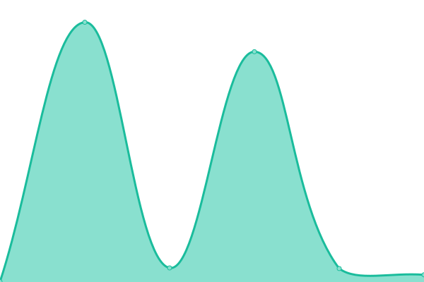

# [📈 Live Status](https://Auroville.github.io/checkbot): <!--live status--> **🟧 Partial outage**

This repository contains the open-source uptime monitor and status page for [Auroville](http://www.auroville.org/), powered by [Upptime](https://github.com/upptime/upptime).

With [Upptime](https://upptime.js.org), you can get your own unlimited and free uptime monitor and status page, powered entirely by a GitHub repository. We use [Issues](https://github.com/Auroville/checkbot/issues) as incident reports, [Actions](https://github.com/Auroville/checkbot/actions) as uptime monitors, and [Pages](https://Auroville.github.io/checkbot) for the status page.

<!--start: status pages-->
<!-- This summary is generated by Upptime (https://github.com/upptime/upptime) -->
<!-- Do not edit this manually, your changes will be overwritten -->
<!-- prettier-ignore -->
| URL | Status | History | Response Time | Uptime |
| --- | ------ | ------- | ------------- | ------ |
|  [Matrimandir](https://matrimandir.org) | 🟩 Up | [matrimandir.yml](https://github.com/Auroville/checkbot/commits/HEAD/history/matrimandir.yml) | 

 526ms
     
 | 

<a href="https://Auroville.github.io/checkbot/history/matrimandir">100.00%</a>
    

|  [MMBooking](https://mmbooking.auroville.org.in) | 🟩 Up | [mm-booking.yml](https://github.com/Auroville/checkbot/commits/HEAD/history/mm-booking.yml) | 

 441ms
     
 | 

<a href="https://Auroville.github.io/checkbot/history/mm-booking">100.00%</a>
    

|  [Pay Auroville](https://pay.auroville.org) | 🟩 Up | [pay-auroville.yml](https://github.com/Auroville/checkbot/commits/HEAD/history/pay-auroville.yml) | 

 498ms
     
 | 

<a href="https://Auroville.github.io/checkbot/history/pay-auroville">100.00%</a>
    

|  [AvToday Stage](https://avt.stage.auroville.org) | 🟥 Down | [av-today-stage.yml](https://github.com/Auroville/checkbot/commits/HEAD/history/av-today-stage.yml) | 

 413ms
     
 | 

<a href="https://Auroville.github.io/checkbot/history/av-today-stage">43.80%</a>
    

<!--end: status pages-->

[**Visit our status website →**](https://Auroville.github.io/checkbot)

## 📄 License

- Powered by: [Upptime](https://github.com/upptime/upptime)
- Code: [MIT](./LICENSE) © [Auroville](http://www.auroville.org/)
- Data in the `./history` directory: [Open Database License](https://opendatacommons.org/licenses/odbl/1-0/)
