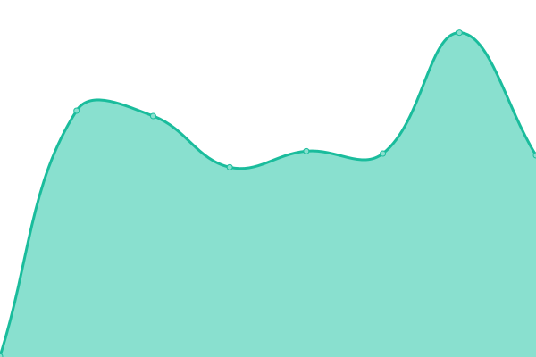

# [📈 Live Status](https://Auroville.github.io/checkbot): <!--live status--> **🟩 All systems operational**

This repository contains the open-source uptime monitor and status page for [Auroville](http://www.auroville.org/), powered by [Upptime](https://github.com/upptime/upptime).

With [Upptime](https://upptime.js.org), you can get your own unlimited and free uptime monitor and status page, powered entirely by a GitHub repository. We use [Issues](https://github.com/Auroville/checkbot/issues) as incident reports, [Actions](https://github.com/Auroville/checkbot/actions) as uptime monitors, and [Pages](https://Auroville.github.io/checkbot) for the status page.

<!--start: status pages-->
<!-- This summary is generated by Upptime (https://github.com/upptime/upptime) -->
<!-- Do not edit this manually, your changes will be overwritten -->
<!-- prettier-ignore -->
| URL | Status | History | Response Time | Uptime |
| --- | ------ | ------- | ------------- | ------ |
|  [Matrimandir Public Website](https://matrimandir.org) | 🟩 Up | [matrimandir-public-website.yml](https://github.com/Auroville/checkbot/commits/HEAD/history/matrimandir-public-website.yml) | 

 427ms
     
 | 

<a href="https://status.auroville.org/history/matrimandir-public-website">100.00%</a>
    

|  [Matrimandir Booking](https://mmbooking.auroville.org.in) | 🟩 Up | [matrimandir-booking.yml](https://github.com/Auroville/checkbot/commits/HEAD/history/matrimandir-booking.yml) | 

 365ms
     
 | 

<a href="https://status.auroville.org/history/matrimandir-booking">100.00%</a>
    

|  [Talam Payment Pages](https://pay.auroville.org) | 🟩 Up | [talam-payment-pages.yml](https://github.com/Auroville/checkbot/commits/HEAD/history/talam-payment-pages.yml) | 

 428ms
     
 | 

<a href="https://status.auroville.org/history/talam-payment-pages">100.00%</a>
    

|  [Proposal](https://proposals.auroville.org.in) | 🟩 Up | [proposal.yml](https://github.com/Auroville/checkbot/commits/HEAD/history/proposal.yml) | 

 435ms
     
 | 

<a href="https://status.auroville.org/history/proposal">100.00%</a>
    

|  [Campus Platform](https://edu.auroville.org) | 🟩 Up | [campus-platform.yml](https://github.com/Auroville/checkbot/commits/HEAD/history/campus-platform.yml) | 

 605ms
     
 | 

<a href="https://status.auroville.org/history/campus-platform">100.00%</a>
    

|  [Directory](https://directory.auroville.org.in) | 🟩 Up | [directory.yml](https://github.com/Auroville/checkbot/commits/HEAD/history/directory.yml) | 

 358ms
     
 | 

<a href="https://status.auroville.org/history/directory">100.00%</a>
    

|  [Visitors Centre Online Booking](https://visit.auroville.org) | 🟩 Up | [visitors-centre-online-booking.yml](https://github.com/Auroville/checkbot/commits/HEAD/history/visitors-centre-online-booking.yml) | 

 493ms
     
 | 

<a href="https://status.auroville.org/history/visitors-centre-online-booking">100.00%</a>
    

|  [House Transfer](https://housing.auroville.org.in) | 🟩 Up | [house-transfer.yml](https://github.com/Auroville/checkbot/commits/HEAD/history/house-transfer.yml) | 

 472ms
     
 | 

<a href="https://status.auroville.org/history/house-transfer">100.00%</a>
    

|  [Bazaar](https://bazaar.auroville.org.in) | 🟩 Up | [bazaar.yml](https://github.com/Auroville/checkbot/commits/HEAD/history/bazaar.yml) | 

 596ms
     
 | 

<a href="https://status.auroville.org/history/bazaar">100.00%</a>
    

|  [Events Calendar](https://events.auroville.org.in) | 🟩 Up | [events-calendar.yml](https://github.com/Auroville/checkbot/commits/HEAD/history/events-calendar.yml) | 

 807ms
     
 | 

<a href="https://status.auroville.org/history/events-calendar">100.00%</a>
    

|  [Farm Management](https://farms-dairy.auroville.org.in) | 🟩 Up | [farm-management.yml](https://github.com/Auroville/checkbot/commits/HEAD/history/farm-management.yml) | 

 455ms
     
 | 

<a href="https://status.auroville.org/history/farm-management">100.00%</a>
    

|  [Transport](https://transport.auroville.org.in) | 🟩 Up | [transport.yml](https://github.com/Auroville/checkbot/commits/HEAD/history/transport.yml) | 

 387ms
     
 | 

<a href="https://status.auroville.org/history/transport">100.00%</a>
    

|  [Auroville Today](https://avtoday.auroville.org) | 🟩 Up | [auroville-today.yml](https://github.com/Auroville/checkbot/commits/HEAD/history/auroville-today.yml) | 

 633ms
     
 | 

<a href="https://status.auroville.org/history/auroville-today">100.00%</a>
    

|  [Talam Pay](https://talampay.auroville.org) | 🟩 Up | [talam-pay.yml](https://github.com/Auroville/checkbot/commits/HEAD/history/talam-pay.yml) | 

 378ms
     
 | 

<a href="https://status.auroville.org/history/talam-pay">100.00%</a>
    

|  [Resident Service](https://rsdashboard.auroville.org.in) | 🟩 Up | [resident-service.yml](https://github.com/Auroville/checkbot/commits/HEAD/history/resident-service.yml) | 

 387ms
     
 | 

<a href="https://status.auroville.org/history/resident-service">100.00%</a>
    

|  [Talampay stage](https://talampaystage.auroville.org.in) | 🟩 Up | [talampay-stage.yml](https://github.com/Auroville/checkbot/commits/HEAD/history/talampay-stage.yml) | 

 542ms
     
 | 

<a href="https://status.auroville.org/history/talampay-stage">100.00%</a>
    

<!--end: status pages-->

[**Visit our status website →**](https://Auroville.github.io/checkbot)

## 📄 License

- Powered by: [Upptime](https://github.com/upptime/upptime)
- Code: [MIT](./LICENSE) © [Auroville](http://www.auroville.org/)
- Data in the `./history` directory: [Open Database License](https://opendatacommons.org/licenses/odbl/1-0/)
